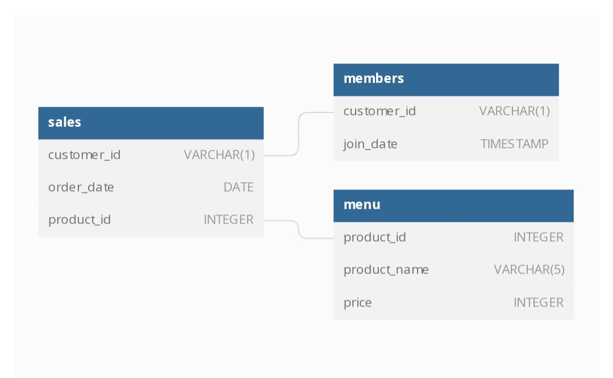

# Danny_ma_SQL_challenge_week1_soln
My solution to Danny_ma's 8 weeks SQL challenge,Case Study 1. Solution contains Aggregate functions ,Window Functions ,JOINS and Common Table Expressions with easy readability.<br><br>


## Introduction
Danny seriously loves Japanese food so in the beginning of 2021, he decides to embark upon a risky venture and opens up a cute little restaurant that sells his 3 favourite foods: sushi, curry and ramen. <br>

Danny’s Diner is in need of your assistance to help the restaurant stay afloat - the restaurant has captured some very basic data from their few months of operation but have no idea how to use their data to help them run the business. <br>

## Problem Statement
Danny wants to use the data to answer a few simple questions about his customers, especially about their visiting patterns, how much money they’ve spent and also which menu items are their favourite. Having this deeper connection with his customers will help him deliver a better and more personalised experience for his loyal customers.
<br>
He plans on using these insights to help him decide whether he should expand the existing customer loyalty program - additionally he needs help to generate some basic datasets so his team can easily inspect the data without needing to use SQL.

Danny has provided you with a sample of his overall customer data due to privacy issues - but he hopes that these examples are enough for you to write fully functioning SQL queries to help him answer his questions!

Danny has shared with you 3 key datasets for this case study:

* sales <br>
* menu <br>
* members <br>
You can inspect the entity relationship diagram below.
## Entity Relationship Diagram




## Case Study Questions
---

**1. What is the total amount each customer spent at the restaurant?**
 ```
    SELECT s.customer_id,SUM(m.price)  "total_amt_spent($)"
    FROM dannys_diner.sales s
    JOIN dannys_diner.menu m
    ON m.product_id=s.product_id
    GROUP BY 1
    ORDER BY 2 DESC;
```

| customer_id | total_amt_spent($) |
| ----------- | ------------------ |
| A           | 76                 |
| B           | 74                 |
| C           | 36                 |

---

**2. How many days has each customer visited the restaurant?**

    WITH unique_days_count as (
    SELECT DISTINCT s.customer_id ,s.order_date days
    FROM dannys_diner.sales s
    )
    
    SELECT customer_id ,COUNT(days) visitation_count
    FROM unique_days_count
    GROUP BY 1
    ORDER BY 1;

| customer_id | visitation_count |
| ----------- | ---------------- |
| A           | 4                |
| B           | 6                |
| C           | 2                |

---
**3 What was the first item from the menu purchased by each customer?**


    WITH  first_order_date as (
    SELECT s.Customer_id ,MIN(s.order_date) order_date
    FROM dannys_diner.sales s
    JOIN dannys_diner.menu m
    ON m.product_id = s.product_id
    GROUP BY 1
    ORDER BY 1
    )
    SELECT Distinct  s.Customer_id , m.product_name, s.order_date date_of_first_order
    FROM dannys_diner.sales s
    JOIN dannys_diner.menu m
    ON m.product_id = s.product_id
    JOIN first_order_date f
    ON f.customer_id=s.customer_id AND f.order_date=s.order_date 
    ORDER BY 1,3;

| customer_id | product_name | date_of_first_order      |
| ----------- | ------------ | ------------------------ |
| A           | curry        | 2021-01-01T00:00:00.000Z |
| A           | sushi        | 2021-01-01T00:00:00.000Z |
| B           | curry        | 2021-01-01T00:00:00.000Z |
| C           | ramen        | 2021-01-01T00:00:00.000Z |

---

**4. What is the most purchased item on the menu and how many times was it purchased by all customers?**

    WITH most_purchased_item as 
    (
    SELECT m.product_name, COUNT(m.product_name),SUM(PRICE)
    FROM dannys_diner.sales s
    JOIN dannys_diner.menu m
    ON s.product_id=m.product_id
    GROUP BY 1
    ORDER BY 2 DESC
    LIMIT 1 
    )
    
    SELECT s.customer_id, m.product_name , COUNT(m.product_name)
    FROM dannys_diner.sales s
    JOIN dannys_diner.menu m
    ON s.product_id=m.product_id
    WHERE m.product_name= (SELECT product_name FROM most_purchased_item)
    GROUP BY 1,2
    ORDER BY 1;

| customer_id | product_name | count |
| ----------- | ------------ | ----- |
| A           | ramen        | 3     |
| B           | ramen        | 2     |
| C           | ramen        | 3     |

---
**5. Which item was the most popular for each customer?**

    WITH customer_item_count as ( 
    SELECT s.customer_id , m.product_name, COUNT(m.product_name) popularity_count
    FROM dannys_diner.sales s
    JOIN dannys_diner.menu m
    ON s.product_id=m.product_id
    GROUP BY 1,2 
    ) ,
    customer_most_popular_item as (
    SELECT customer_id, MAX(popularity_count) popularity_count
    FROM customer_item_count
    GROUP BY 1
    )
    
    SELECT  c.customer_id ,c.product_name, c.popularity_count
    FROM customer_item_count c
    JOIN customer_most_popular_item p
    ON c.customer_id = p.customer_id AND c.popularity_count = p.popularity_count
    ORDER BY 3 DESC,1;

| customer_id | product_name | popularity_count |
| ----------- | ------------ | ---------------- |
| A           | ramen        | 3                |
| C           | ramen        | 3                |
| B           | sushi        | 2                |
| B           | curry        | 2                |
| B           | ramen        | 2                |

---

**6. Which item was purchased first by the customer after they became a member?**

    WITH members_order as (
    SELECT mb.Customer_id, m.product_name , s.order_date
    FROM dannys_diner.sales s
    JOIN dannys_diner.menu m
    ON s.product_id=m.product_id
    JOIN dannys_diner.members mb
    ON  mb.customer_id=s.customer_id and s.order_date >= mb.join_date  
    ), first_date_order_as_a_member as (
    SELECT customer_id ,MIN(order_date) order_date
    FROM members_order
    GROUP BY 1 
    )
    SELECT f.customer_id ,m.product_name, f.order_date first_order_date_as_a_member
    FROM dannys_diner.sales s
    JOIN first_date_order_as_a_member f 
    ON f.customer_id=s.customer_id AND f.order_date=s.order_date
    JOIN dannys_diner.menu m
    ON  s.product_id=m.product_id 
    ORDER BY 1;

| customer_id | product_name | first_order_date_as_a_member |
| ----------- | ------------ | ---------------------------- |
| A           | curry        | 2021-01-07T00:00:00.000Z     |
| B           | sushi        | 2021-01-11T00:00:00.000Z     |

---
**7. Which item was purchased just before the customer became a member?**

    WITH members_order_before_becoming_members as (
    SELECT mb.Customer_id, m.product_name ,s.order_date
    FROM dannys_diner.sales s
    JOIN dannys_diner.menu m
    ON s.product_id=m.product_id
    JOIN dannys_diner.members mb
    ON  mb.customer_id=s.customer_id and s.order_date < mb.join_date  
    ), last_order_date_as_a_non_member as (
    SELECT customer_id ,MAX(order_date) order_date
    FROM members_order_before_becoming_members 
    GROUP BY 1 
    )
    SELECT l.customer_id , m.product_name, l.order_date last_order_date_as_a_non_member
    FROM dannys_diner.sales s
    JOIN last_order_date_as_a_non_member l 
    ON l.customer_id=s.customer_id AND l.order_date=s.order_date
    JOIN dannys_diner.menu m
    ON  s.product_id=m.product_id 
    ORDER BY 1;

| customer_id | product_name | last_order_date_as_a_non_member |
| ----------- | ------------ | ------------------------------- |
| A           | sushi        | 2021-01-01T00:00:00.000Z        |
| A           | curry        | 2021-01-01T00:00:00.000Z        |
| B           | sushi        | 2021-01-04T00:00:00.000Z        |

---
**8. What is the total items and amount spent for each member before they became a member?**

    SELECT s.Customer_id, SUM(m.price) "total_amt_Spent_before_becoming_a_member($)", COUNT(m.product_id) number_of_orders
    FROM dannys_diner.sales s
    JOIN dannys_diner.menu m
    ON s.product_id=m.product_id
    JOIN dannys_diner.members mb
    ON  mb.customer_id=s.customer_id and s.order_date < mb.join_date  
    GROUP BY 1 
    ORDER BY 2 DESC ,1;

| customer_id | total_amt_Spent_before_becoming_a_member($) | number_of_orders |
| ----------- | ------------------------------------------- | ---------------- |
| B           | 40                                          | 3                |
| A           | 25                                          | 2                |

---
**9.  If each $1 spent equates to 10 points and sushi has a 2x points multiplier - how many points would each customer have?**

    WITH customer_points as(
    SELECT s.customer_id, 
    CASE WHEN lower(m.product_name)='sushi' Then (m.price)*20 
    					ELSE  price*10 END AS points
    from dannys_diner.sales s
    JOIN dannys_diner.menu m 
    ON s.product_id=m.product_id)
    
    SELECT customer_id , SUM(points) total_points
    FROM customer_points
    GROUP BY 1 
    ORDER BY  1 ;

| customer_id | total_points |
| ----------- | ------------ |
| A           | 860          |
| B           | 940          |
| C           | 360          |

---
**10. In the first week after a customer joins the program (including their join date) they earn 2x points on all items, not just sushi - how many points do customer A and B have at the end of January?**

    WITH members_jan_order as (
    SELECT s.customer_id , m.product_name, m.price, s.order_date , mb.join_date, (mb.join_date + integer '6')  first_week_order_date_as_a_member
    FROM dannys_diner.sales s
    JOIN dannys_diner.menu m
    ON s.product_id=m.product_id
    JOIN dannys_diner.members mb
    ON  mb.customer_id=s.customer_id and (s.order_date >= mb.join_date AND  s.order_date < '2021-02-01')
     ), 
    members_jan_points as (SELECT customer_id, product_name, price, order_date, join_date , 
       CASE WHEN order_date <= first_week_order_date_as_a_member  THEN 20 * price 
       WHEN order_date >first_week_order_date_as_a_member and lower(product_name)='sushi' THEN  20 * price 
       ELSE price *10 END as points 
       FROM members_jan_order )
    
    SELECT customer_id, SUM(points) total_january_points
    FROM members_jan_points
    GROUP BY 1
    ORDER BY 1;

| customer_id | total_january_points |
| ----------- | -------------------- |
| A           | 1020                 |
| B           | 320                  |

---

## Bonus Questions
## Join All The Things
**Bonus Question 1**

    SELECT s.customer_id, s.order_date, m.product_name , m.price ,
    CASE WHEN s.customer_id=mb.customer_id AND s.order_date>= join_date THEN  'Y'
    ELSE 'N' END as Members 
    FROM dannys_diner.sales s
    JOIN dannys_diner.menu m
    ON s.product_id=m.product_id
    LEFT JOIN dannys_diner.members mb
    ON  mb.customer_id=s.customer_id
    ORDER By 1 , 2 ;

| customer_id | order_date               | product_name | price | members |
| ----------- | ------------------------ | ------------ | ----- | ------- |
| A           | 2021-01-01T00:00:00.000Z | sushi        | 10    | N       |
| A           | 2021-01-01T00:00:00.000Z | curry        | 15    | N       |
| A           | 2021-01-07T00:00:00.000Z | curry        | 15    | Y       |
| A           | 2021-01-10T00:00:00.000Z | ramen        | 12    | Y       |
| A           | 2021-01-11T00:00:00.000Z | ramen        | 12    | Y       |
| A           | 2021-01-11T00:00:00.000Z | ramen        | 12    | Y       |
| B           | 2021-01-01T00:00:00.000Z | curry        | 15    | N       |
| B           | 2021-01-02T00:00:00.000Z | curry        | 15    | N       |
| B           | 2021-01-04T00:00:00.000Z | sushi        | 10    | N       |
| B           | 2021-01-11T00:00:00.000Z | sushi        | 10    | Y       |
| B           | 2021-01-16T00:00:00.000Z | ramen        | 12    | Y       |
| B           | 2021-02-01T00:00:00.000Z | ramen        | 12    | Y       |
| C           | 2021-01-01T00:00:00.000Z | ramen        | 12    | N       |
| C           | 2021-01-01T00:00:00.000Z | ramen        | 12    | N       |
| C           | 2021-01-07T00:00:00.000Z | ramen        | 12    | N       |

---
**Bonus Question 2**

    WITH member_ranking as (
    SELECT s.customer_id ,s.order_date, m.product_name ,m.price ,
    CASE WHEN s.customer_id=mb.customer_id AND s.order_date>= join_date THEN  'Y'
    ELSE 'N' END as Members 
    FROM dannys_diner.sales s
    JOIN dannys_diner.menu m
    ON s.product_id=m.product_id
    LEFT JOIN dannys_diner.members mb
    ON  mb.customer_id=s.customer_id
    ORDER By 1 , 2)

    SELECT m.customer_id , m.order_date, m.product_name, m.Price , m.members,
    CASE WHEN m.customer_id=mb.customer_id AND m.order_date>=mb.join_date 
    THEN  DENSE_RANK() OVER (PARTITION BY m.customer_id,m.members ORDER BY m.order_date ) END as Ranking
    FROM member_ranking m
    LEFT JOIN dannys_diner.members mb
    ON  mb.customer_id=m.customer_id 

| customer_id | order_date               | product_name | price | members | ranking |
| ----------- | ------------------------ | ------------ | ----- | ------- | ------- |
| A           | 2021-01-01T00:00:00.000Z | sushi        | 10    | N       | null    |
| A           | 2021-01-01T00:00:00.000Z | curry        | 15    | N       | null    |
| A           | 2021-01-07T00:00:00.000Z | curry        | 15    | Y       | 1       |
| A           | 2021-01-10T00:00:00.000Z | ramen        | 12    | Y       | 2       |
| A           | 2021-01-11T00:00:00.000Z | ramen        | 12    | Y       | 3       |
| A           | 2021-01-11T00:00:00.000Z | ramen        | 12    | Y       | 3       |
| B           | 2021-01-01T00:00:00.000Z | curry        | 15    | N       | null    |
| B           | 2021-01-02T00:00:00.000Z | curry        | 15    | N       | null    |
| B           | 2021-01-04T00:00:00.000Z | sushi        | 10    | N       | null    |
| B           | 2021-01-11T00:00:00.000Z | sushi        | 10    | Y       | 1       |
| B           | 2021-01-16T00:00:00.000Z | ramen        | 12    | Y       | 2       |
| B           | 2021-02-01T00:00:00.000Z | ramen        | 12    | Y       | 3       |
| C           | 2021-01-01T00:00:00.000Z | ramen        | 12    | N       | null    |
| C           | 2021-01-01T00:00:00.000Z | ramen        | 12    | N       | null    |
| C           | 2021-01-07T00:00:00.000Z | ramen        | 12    | N       | null    |

---


<br>

Thanks for taking your time in going through my solution for danny_ma SQL challenge week 1 . 
